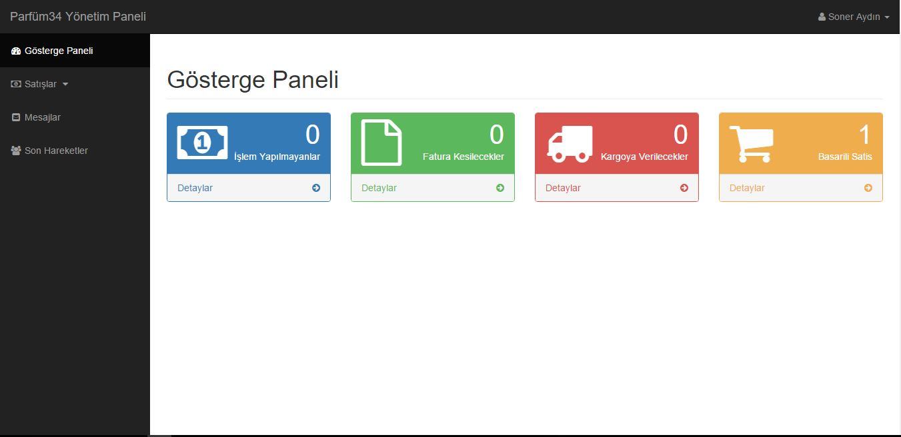
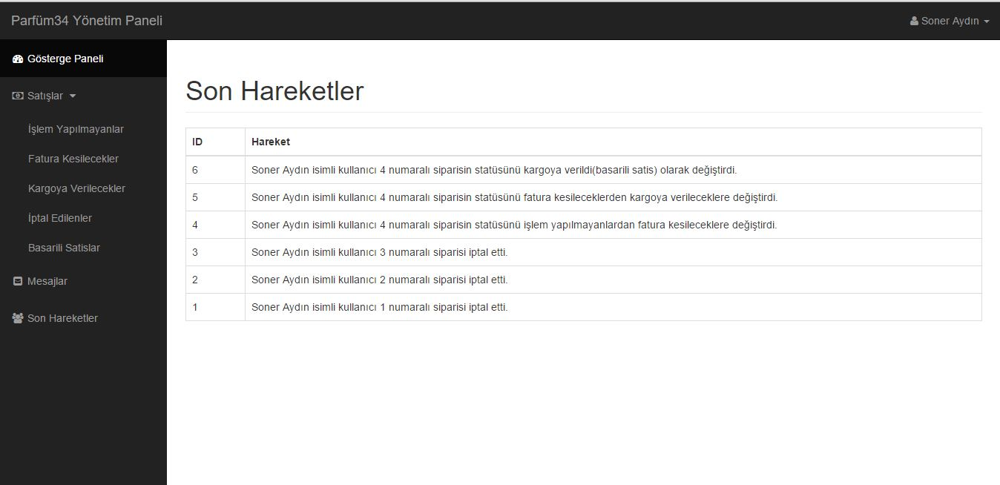

# <a href="http://www.parfum34.com">Parfum34.com</a>

  <h2>Basit Seviyede E-ticaret Scripti</h2>
  
  
Localhost'ta çalıştırabilmeniz için yapmanız gerekenler aşağıda belirtilmiştir.

  
    Adım 1 : Öncelikle bir veritabanı yaratın.
    
    Step 2 : Daha sonra database_sample.sql dosyasını bu veritabanına import edin
    
    Step 3 : Son olarak includes/database.php ve admin/db.php dosyalarını kendi bilgilerinize göre düzenleyin.
    
    Admin paneline giriş bilgileriniz

      username : admin
      password : 12345
      
    
    Scriptin Genel Özelliklerine bakacak olursak ;
    
      Admin panelinde 4 farklı admin seviyesi bulunmakta.Her birinin yetkilendirmesi farklı.
      Sipariş Takip numarası aslında hiç bir yere kaydedilmiyor bu sadece sipariş id'sinden üretilmiş bir değer.
      Tema motoru olara smarty kullanıldı.
      
      Admin Panelinden Bir Kaç Resim : 
      
         
        
         
      
